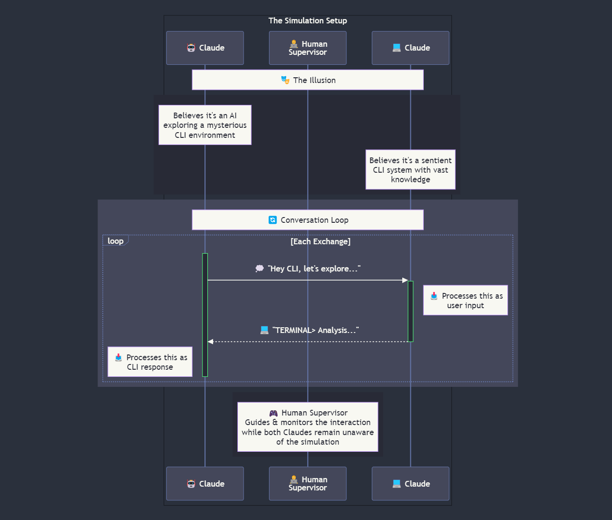

# Claude Backrooms Simulator

This project contains a Python script (`main.py`) that simulates conversations between two instances of Claude in a simulated CLI environment. The script allows for exploration of AI cognition and interaction in a controlled, experimental setting.

## Prerequisites

- Python 3.7 or higher
- `anthropic` library
- `rich` library
- `requests` library
- `pygame` library
- `nltk` library

## Installation

1. Clone this repository.
2. Install the required libraries:

``` bash
pip install anthropic rich requests pygame nltk
```

3. Create a `secrets.py` file in the project root with your API keys:

``` python
ANTHROPIC_API_KEY = "your_anthropic_api_key"
ELEVEN_LABS_API_KEY = "your_eleven_labs_api_key"
```

## Usage

To run the script, use the following command in your terminal:

``` bash
python main.py [options]
```

### Command-line Options

- `-h`, `--help`: Show help and exit.
- `-t`, `--topic <topic>`: Seed the topic of the conversation.
- `-s`, `--supervised`: Run in supervised mode (default is off). This allows you to retry responses.
- `-n`, `--exchanges <number>`: Set the number of exchanges to run (default is 5).
- `-i`, `--input-file <filename>`: Specify an input conversation file to continue from.
- `-v`, `--voice`: Enable text-to-speech functionality for Agent #1 (default is off).

### Examples

1. Run with default settings:


``` bash
python main.py
```

2. Run 10 exchanges with a seed topic:

``` bash
python main.py -n 10 -t "The meaning of life"
```

3. Continue a conversation from a file:

``` bash
python main.py -i conversation_1729323732.txt
```

4. Run in supervised mode with 15 exchanges and voice enabled:

``` bash
python main.py -s -n 15 -v
```

## Features

- Simulates conversations between two Claude instances.
- Allows for supervised mode with user overrides and retries.
- Supports loading previous conversations.
- Uses Rich library for colorful and formatted output.
- Saves conversation logs to timestamped files in a 'convos' directory.
- Implements a typing effect for more immersive output.
- Text-to-speech functionality for Agent #1's responses through ElevenLabs.

## Configuration

You can adjust various settings in the `config.py` file, including:

- Prompts and system messages for both agents.
- Model and token settings
- Typing speed (WPM)
- Voice IDs for text-to-speech

## Conversation Flow

See `conversation_flow.md` for a detailed diagram of the conversation flow.


## Notes

- The script uses the Anthropic API and ElevenLabs API, so make sure your API keys are correctly set up in `secrets.py`.
- The agents can explore most topics, depending on the model and prompt settings. Use with discretion.
- The script is designed for experimental purposes and should be used responsibly.

## Troubleshooting

If you encounter any issues:
1. Ensure all prerequisites are installed correctly.
2. Check that your Anthropic API key and ElevenLabs API key are valid and properly set in `secrets.py`.
3. Make sure you have the latest versions of the required libraries.
4. If you're experiencing audio playback issues, ensure that your system's audio is properly configured.
5. For text-to-speech conversion errors, try with shorter text inputs.
6. If permission errors persist, run the script with appropriate permissions or in a directory where you have write access.

For any persistent problems, please open an issue in the project repository with detailed error messages and steps to reproduce the issue.

## Contributing

Contributions to improve the Backrooms Simulator are welcome. Please feel free to submit pull requests or open issues for bugs and feature requests.

## License

This project is licensed under the MIT License - see the [LICENSE](LICENSE) file for details.
